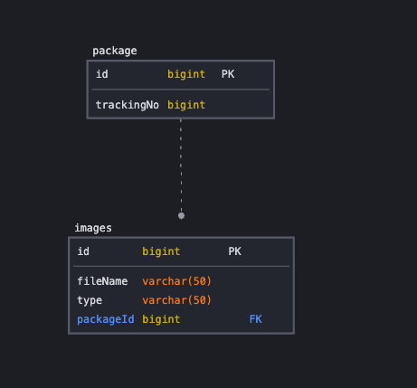
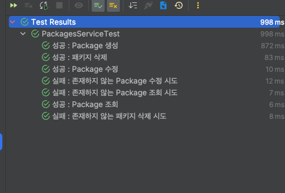
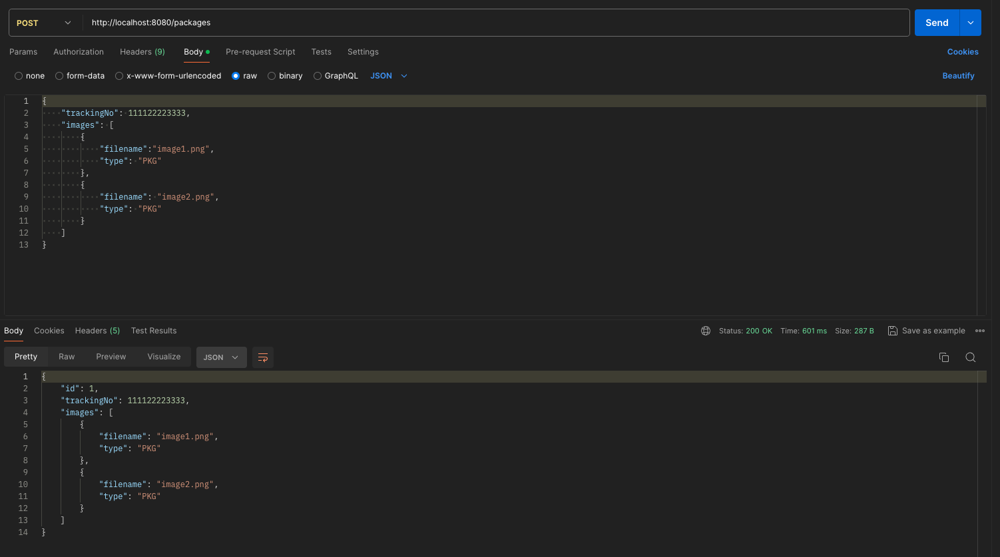
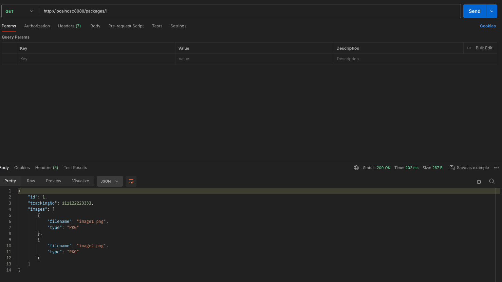
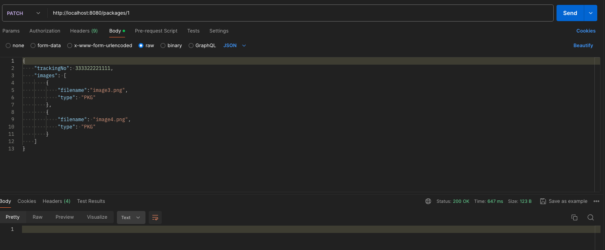
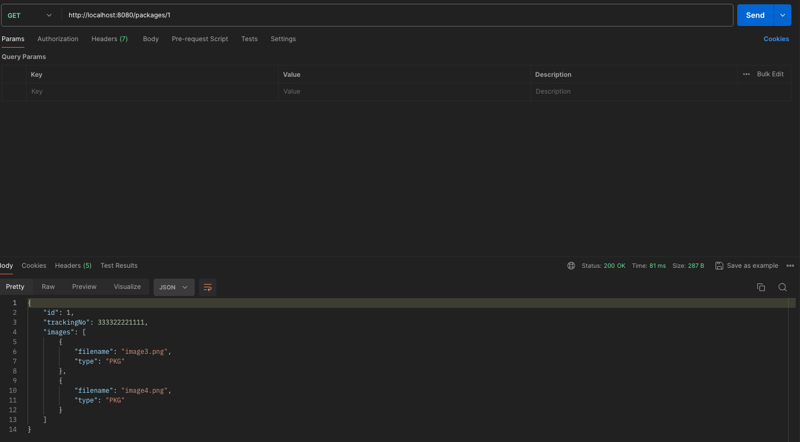
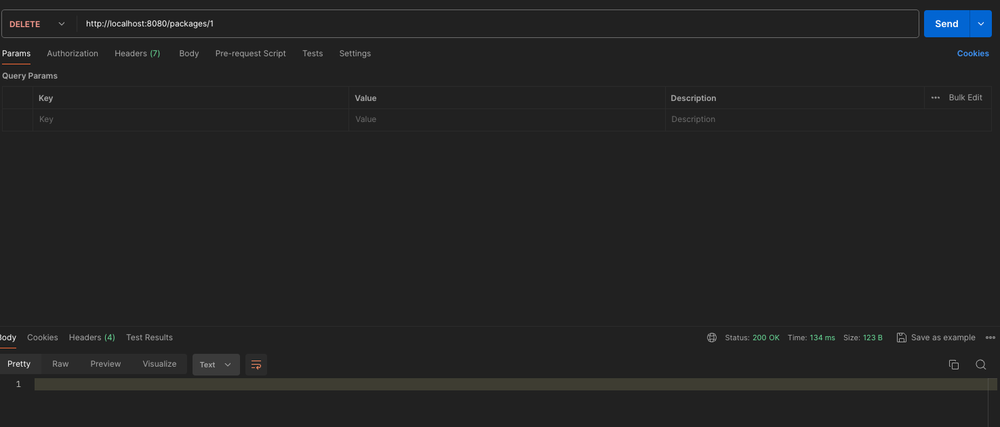
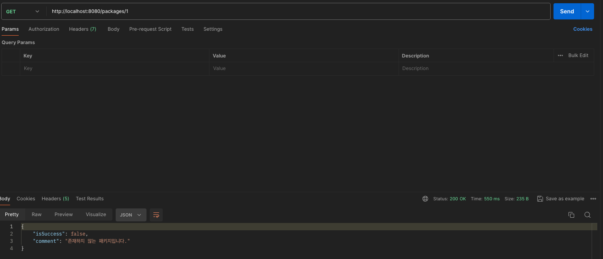
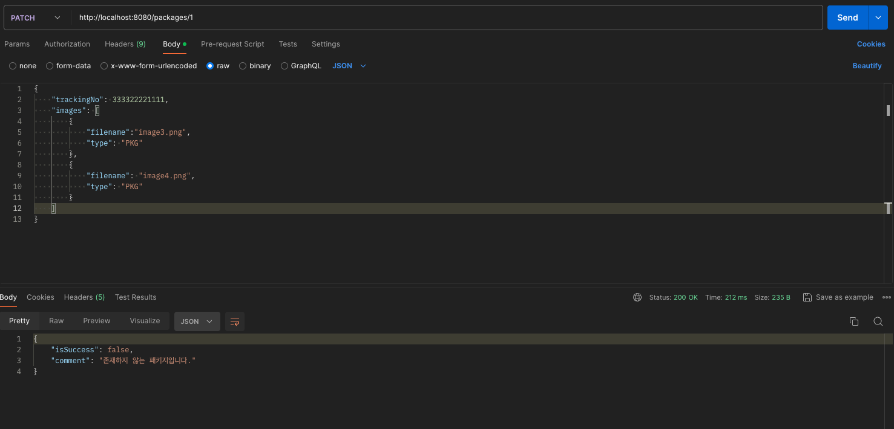

# 만나 Package Crud API 작성

### Requirements

- Package 생성, 조회, 수정, 삭제 API 개발
- 데이터 통신은 Json 형식
- 테스트 코드를 작성

### ERD

### Tech Stack

#### Server

- Java 17, Spring Boot 3.2, Spring MVC, JPA

#### DataBase

- local : Mysql, test : H2

#### Etc

- Gradle, Docker

#### Explain

- docker-compose 파일을 통해 local, test DB 환경을 설정할 수 있도록 작성하였습니다.
- 서비스 계층의 테스트 코드 작성을 통해 코드를 검증하였습니다.

#### Result

##### 테스트 코드 결과

##### Postman을 통한 테스트

- 패키지 생성
트

- 패키지 수정

수정 후 조회

- 패키지 삭제

- 예외 처리
    - 존재하지 않는 패키지 조회
  
    - 존재하지 않는 패키지 수정
  

