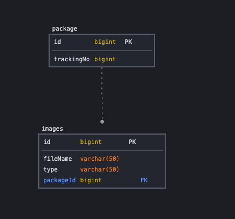

# 만나 Package Crud API 작성

### Requirements

- Package 생성, 조회, 수정, 삭제 API 개발
- 데이터 통신은 Json 형식을 사용한다.
- 테스트 코드를 작성한다.

### ERD

### Tech Stack

#### Server

- Java 17, Spring Boot 3.2, Spring MVC, JPA

#### DataBase

- Mysql, H2

#### Etc

- Gradle, Docker

#### Explain

- docker-compose 파일을 통해 local, test DB 환경을 세팅함
- 서비스 계층의 테스트 코드 작성을 통해 코드를 검증한다.

